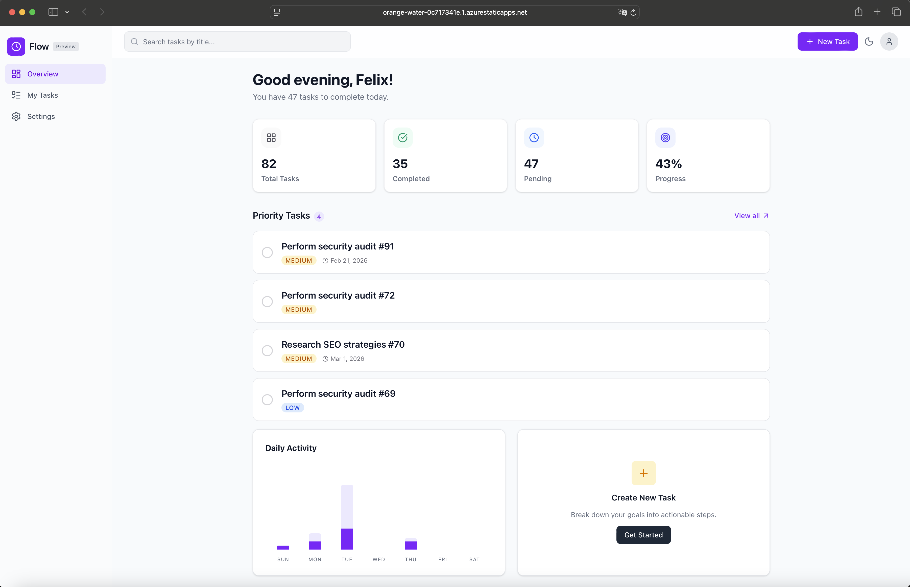
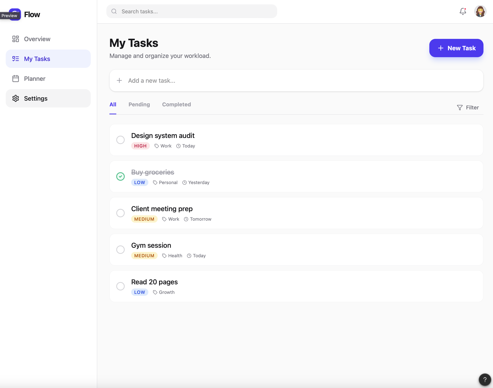
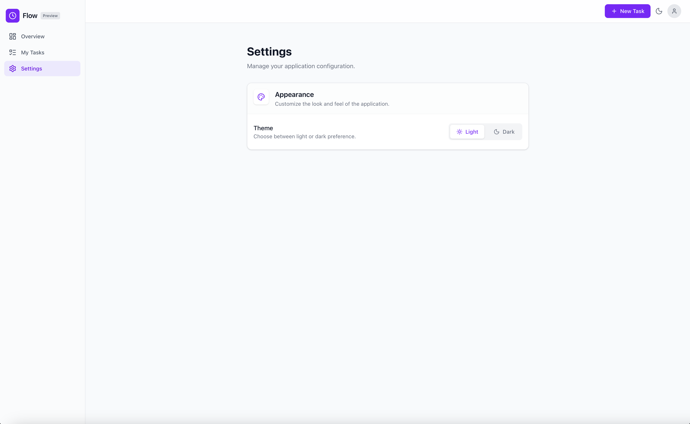
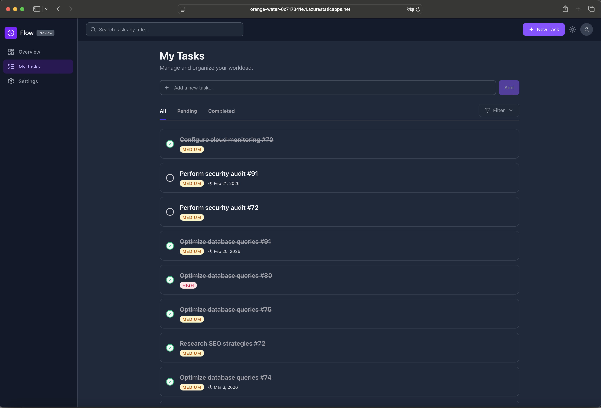
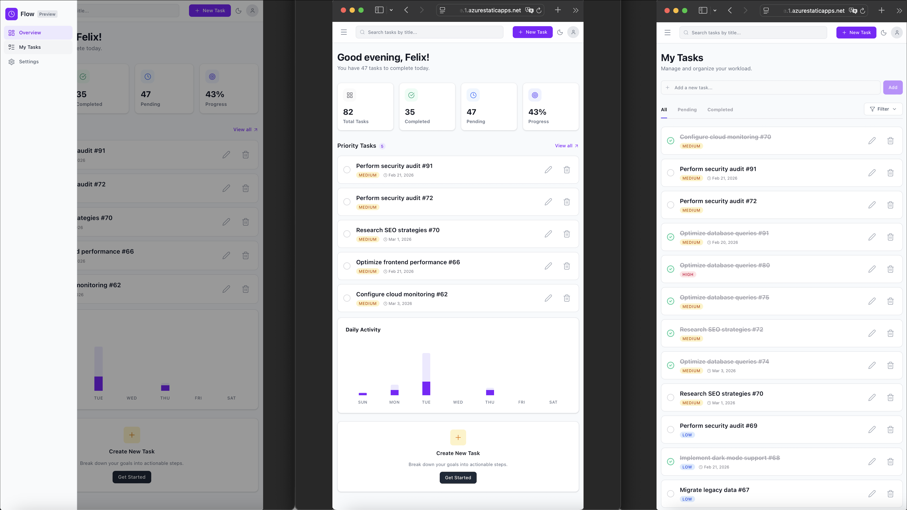
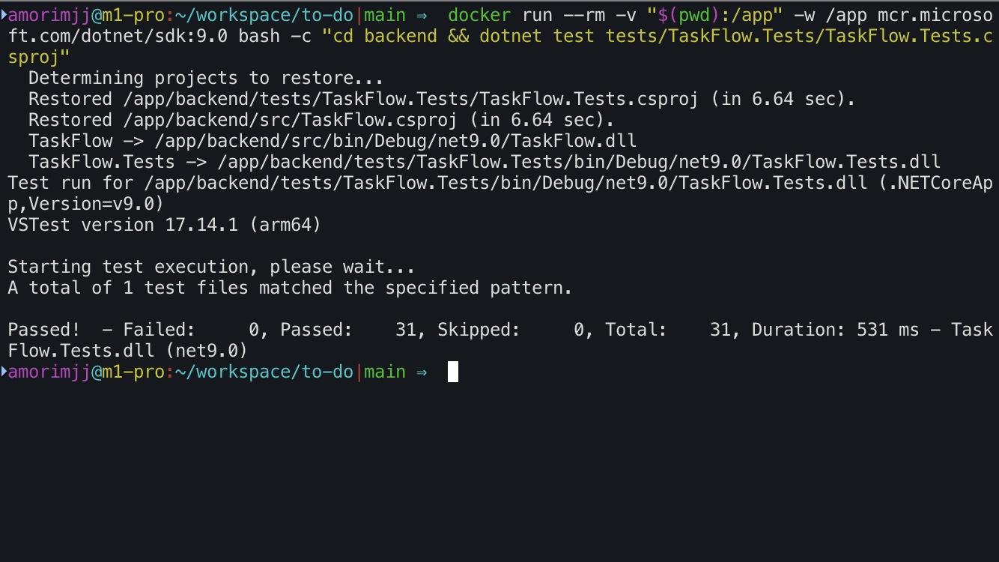
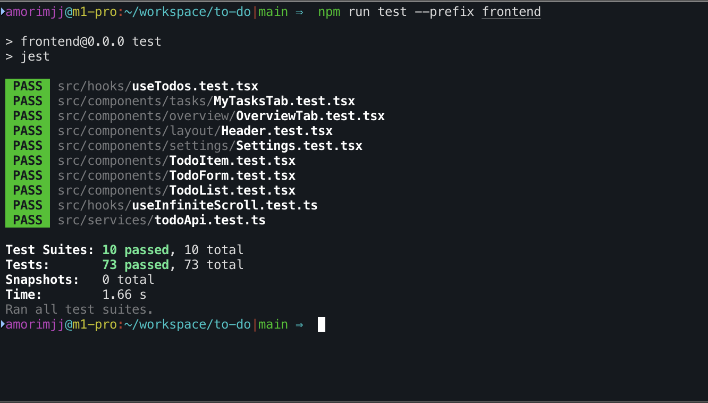
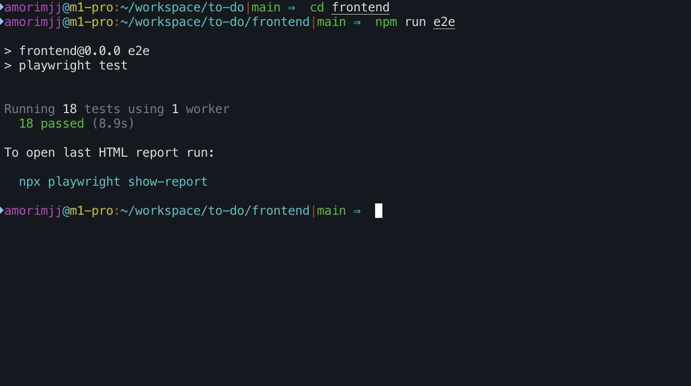

# TaskFlow - Full Stack To-Do Application

> I truly appreciate the opportunity to participate in a selection process for such an important matter, one that gives us the chance to make a real difference in people's lives. Having lost beloved family members to this devastating disease, I deeply understand its profound impact and am personally committed to contributing meaningful solutions.
> This project reflects my dedication to writing clean, well-tested, production-ready code that can serve as the foundation for truly impactful work in this vital field.

## Live Demo

- [TaskFlow live on Azure](https://orange-water-0c717341e.1.azurestaticapps.net)

> A video walkthrough of the application is available [here](assets/todo-demo.mp4)
>
> <p align="center">
>   <video src="https://github.com/user-attachments/assets/561a22de-d6cd-4c1c-ad38-a6f02b36480c" width="80%" controls></video>

</p>

## Screenshots

| Overview Dashboard               | Task Management               |
| -------------------------------- | ----------------------------- |
|  |  |

| Settings                         | Dark Mode                          |
| -------------------------------- | ---------------------------------- |
|  |  |

| Mobile View                            |
| -------------------------------------- |
|  |

## Tech Stack

- **Backend:** ASP.NET Core 9, EF Core, SQLite, FluentValidation, Swagger
- **Frontend:** React 19, Vite, Tailwind CSS 4, Lucide Icons
- **Testing:** NUnit (Backend), Jest + React Testing Library (Frontend), Playwright (E2E)
- **DevOps:** Docker, GitHub Actions, Azure Static Web Apps + App Service

## Key Highlights

- **Clean, readable code** — Focused on clarity and maintainability over
  premature optimization. The architecture and separation of concerns keeps the codebase easy to navigate and extend.

- **Comprehensive test coverage** — Unit tests (NUnit + Jest), integration tests, and end-to-end tests (Playwright) with Page Object Model, state isolation, and CI integration.

- **Scalability-ready architecture** — While applying heavy scalability patterns at this stage would be overkill, the core of the application and Command/Query separation makes it straightforward to introduce a queue system or event-driven processing in the future.

- **Deliberate omission of authentication** — Authentication is a critical component that deserves a fully planned and secure implementation. Rather than shipping an incomplete or hastily designed version, I chose to leave it out entirely. The architecture is prepared for it — Commands and Queries are designed to easily incorporate `UserId` filtering once JWT auth is integrated.

- **Responsive design** — Mobile-friendly layouts with Tailwind CSS 4.

- **Optimistic updates & atomic operations** — The UI responds immediately to user actions while API calls happen in the background, with proper rollback on failure.

- **API-first architecture** — Clean REST API with Swagger documentation, server-side pagination, filtering, and sorting.

## Features

- Full CRUD for tasks with priority levels (Low, Medium, High)
- Due date management
- Completion toggle with optimistic UI
- Overview dashboard with weekly summary and statistics
- Filtering by status and priority
- Server-side pagination with infinite scroll
- Search functionality
- Dark/Light theme
- Quick Add for fast task creation
- Data Seed

## Quick Start (Docker)

```bash
docker compose up --build
```

- Frontend: http://localhost:3000
- Backend API: http://localhost:5005
- Swagger UI: http://localhost:5005/swagger

> A video walkthrough of application startup and seed [here](assets/todo-running-and-seed.mp4)
>
> <p align="center">
>   <video src="https://github.com/user-attachments/assets/44ca21e4-0127-466f-93fa-700cb7f2c790" width="80%" controls></video>

</p>

> Running the seed command

```bash
docker run --rm -v "$(pwd):/app" -w /app mcr.microsoft.com/dotnet/sdk:9.0 bash -c "cd backend/src && dotnet run -- --seed"
```

### Prerequisites

- Docker Desktop
- .NET 9 SDK (local dev without Docker)
- Node.js 20+ (local dev without Docker)

## Running Tests

> A video walkthrough of application tests [here](assets/todo-running-tests.mp4)
>
> <p align="center">
>   <video src="https://github.com/user-attachments/assets/6b6011de-27c6-4b0f-b927-41b24ddaafb9" width="80%" controls></video>

</p>

### Backend (NUnit)

```bash
docker run --rm -v "$(pwd):/app" -w /app mcr.microsoft.com/dotnet/sdk:9.0 bash -c "cd backend/tests/TaskFlow.Tests && dotnet test"
```



### Frontend Unit (Jest)

```bash
cd frontend
npm test
```



### E2E (Playwright)

```bash
docker compose -f docker-compose.e2e.yml up -d
cd frontendnpm run e2e
```



## Architecture

- **Lightweight CQRS** — Custom Command/Query pattern without external libraries like MediatR, keeping dependencies minimal while ensuring clean separation of concerns.
- **Single-File Features** — Each command/query is colocated with its handler and validator for better discoverability.
- **E2E State API** — A dedicated `/api/test/reset` endpoint (enabled only in E2E environment) allows Playwright to reset the database before each test.

## CI/CD Pipeline

            ┌──────────────┐
            │ Push / PR    │
            │ to main      │
            └──────┬───────┘
                   │
                   ▼
    ┌───────────────────────────────┐
    │          E2E Tests            |
    | Docker Compose + Playwright   │
    └──────────────┬────────────────┘
                   │ ✅
              ┌────┴────┐
              ▼         ▼
        ┌────────┐  ┌──────────────┐
        │ Build  │  │ Build & Test │
        │   API  │  │ Frontend     │
        │ + Test │  │ (Jest)       │
        └───┬────┘  └──────┬───────┘
            │✅            |✅
            ▼              ▼
        ┌────────┐ ┌──────────────┐
        │ Deploy │ │    Deploy    │
        │  API   │ │   Frontend   │
        │ Azure  │ │ Azure Static │
        │App Svc │ │   Web Apps   │
        └────────┘ └──────────────┘

**Pipeline stages:**

1. **E2E Tests** — Spins up the full stack via Docker Compose, waits for health check, then runs Playwright tests. Artifacts (report) are uploaded on every run.
2. **Backend Build & Test** — Runs NUnit tests, builds the .NET 9 API, and publishes the artifact. Only runs after E2E passes.
3. **Frontend Build & Test** — Runs Jest unit tests, then builds and deploys the React app. Only runs after E2E passes.
4. **Deployment** — API deploys to **Azure App Service** Frontend deploys to **Azure Static Web Apps**. Both use secure OIDC / token-based authentication with Azure.

## Trade-offs

| Decision                 | Rationale                                                                                 |
| ------------------------ | ----------------------------------------------------------------------------------------- |
| SQLite                   | Chosen matching the project specs.                                                        |
| No Authentication        | Intentionally omitted — see Key Highlights.                                               |
| In-Memory for Unit Tests | EF Core In-Memory provider for speed and isolation.                                       |
| Hard Delete              | Tasks are permanently removed. Soft-deletes for auditability would be a future iteration. |
